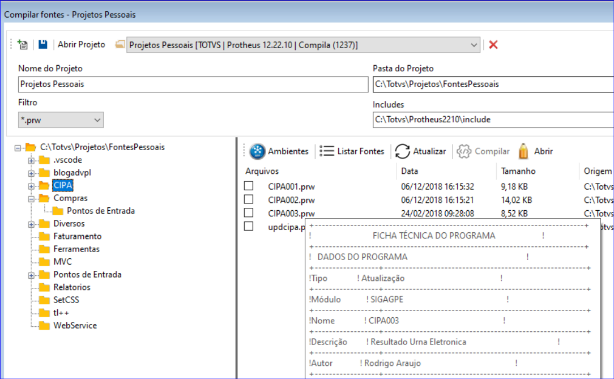

# Compilando fontes via linha de comando

Principais características:

- Não tem comunicação cliente/server TCP, os comandos são executados diretamente no AppServer.
- Ambiente simples que necessita apenas do appre, binário do appserver e arquivo de configuração "appserver.ini".
- Compilação mais rápida.
- Suporte a atual chave de compilação utilizada pelo TDS e TDSCli.
- Chave de compilação para Linux utilizando criptografia AES 256bits.
- Compatível com Sistemas Operacionais Windows e Linux.

Exemplo:
<pre>
c:\totvs\protheus\bin\appserver.exe -compile -files=c:\totvs\projetos\fonte.prw -includes=c:\totvs\protheus\include -src=c:\totvs\projetos -env=NomeAmbiente
</pre>

Parametros:
<pre>
-compile	Necessário para inicialização da ferramenta
-files	        Informa quais fontes serão compilados
-includes	Informa o diretório de includes usado durante a o pré-processamento dos fontes.
-env	        Informa o ambiente que deverá ser acessado para compilação.
-outreport	Gera os arquivos compile_sucess.log, que contem a lista de fontes compilados com sucesso no formato do arquivo .lst, e compile_errors.log, que contem a lista de fontes não compilados e os erros de compilação.   
</pre>

